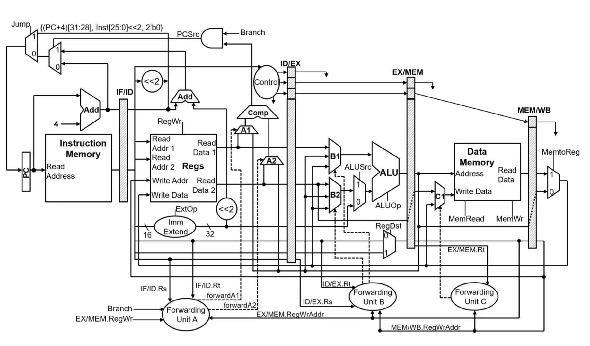

# 🚀 CPU_ver620

> **A five-stage pipelined CPU design attempt following the study of digital logic and processor architecture.**
> **基于数字逻辑与处理器体系结构学习的五级流水线CPU设计尝试。**



---

## 项目简介 | Project Overview

实现了一个基于 LoongArch 架构的五级流水线 CPU
This project implements a 5-stage pipelined CPU based on the MIPS architecture

---

## 主要特性 | Features

- **五级流水线 (5-stage pipeline):**IF - ID - EX - MEM - WB
- **分支指令处理 (Branch Handling):**分支指令的 PC 在 ID 阶段计算，后续可考虑加入分支预测。PC for branch instructions is computed in the ID stage; branch prediction can be considered in the future.
- **冒险处理 (Hazard Handling):**当前设计未包含冒险检测单元（Hazard Unit not included）。
- **模块化设计 (Modular Design):**
  代码结构清晰，便于扩展与维护。

---

## 设计结构 | Design Structure

```
IF  ->  ID  ->  EX  ->  MEM  ->  WB
```

- **IF (Instruction Fetch)**
- **ID (Instruction Decode)**
- **EX (Execute)**
- **MEM (Memory Access)**
- **WB (Write Back)**

---

## 控制信号 | Control Signals

[基础整数算数指令总结表](./LA32_比赛限定版_v1.1.xlsx)

目前工作：完成对一般运算、访存、分支指令的支持


---

## 文件结构 | File Structure

```
cpu_3_ver620/
├── design/                # 设计相关图片与文档
├── src/                   # 源代码
├── testbench/             # 测试平台
├── README.md              # 项目说明
└── ...
```
