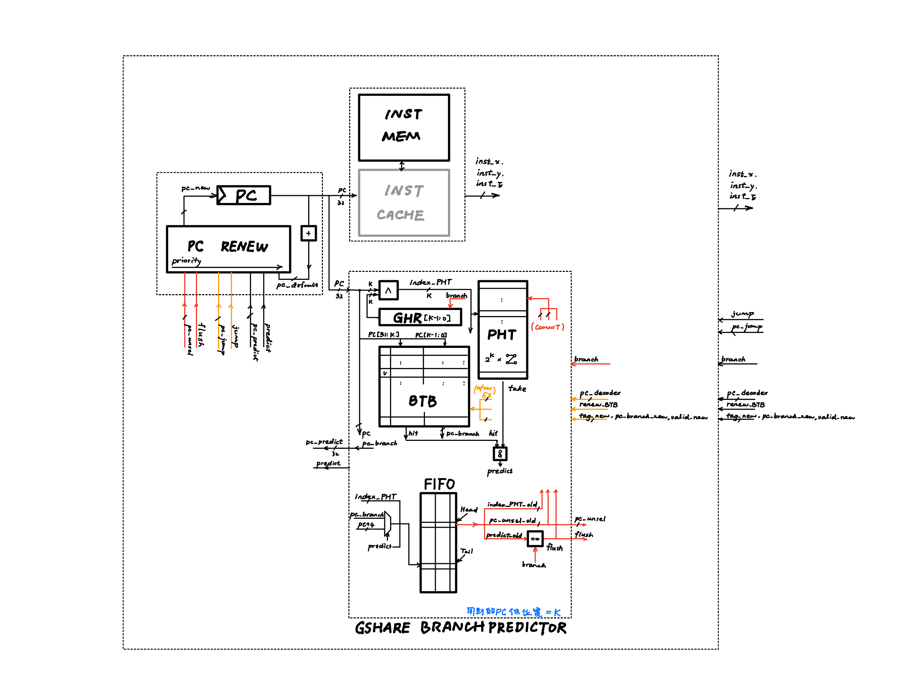
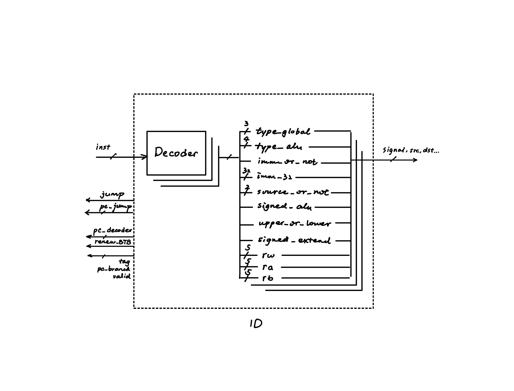
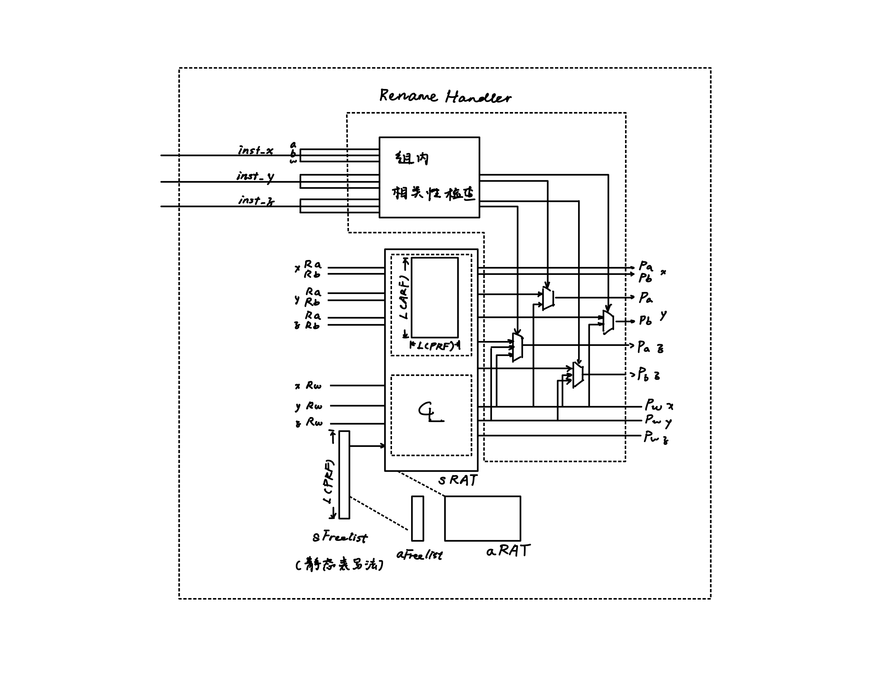
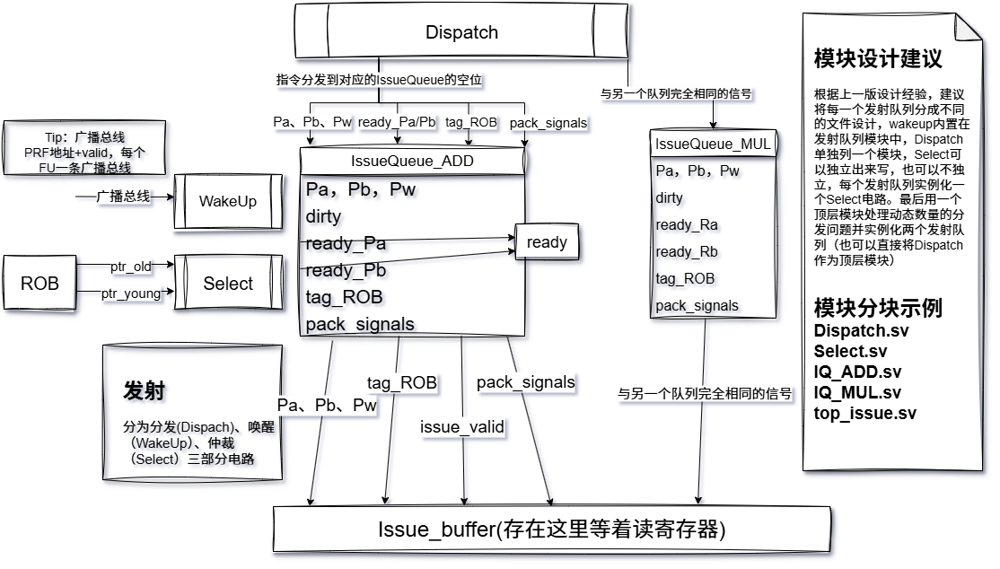
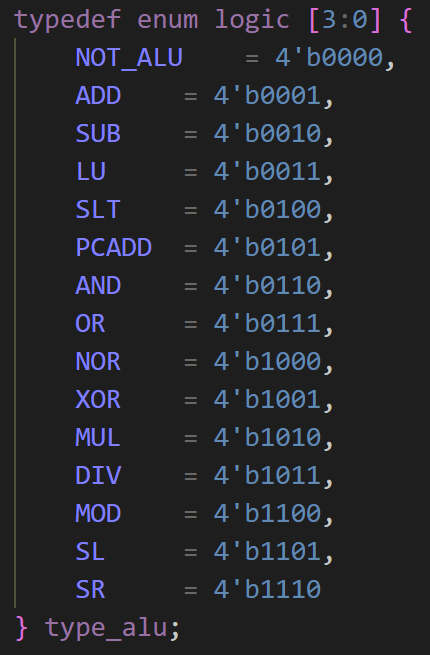
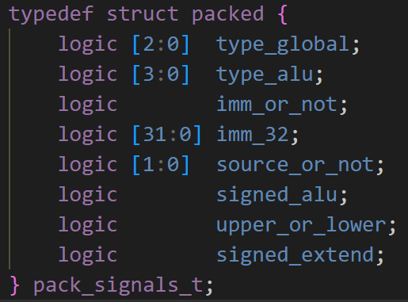
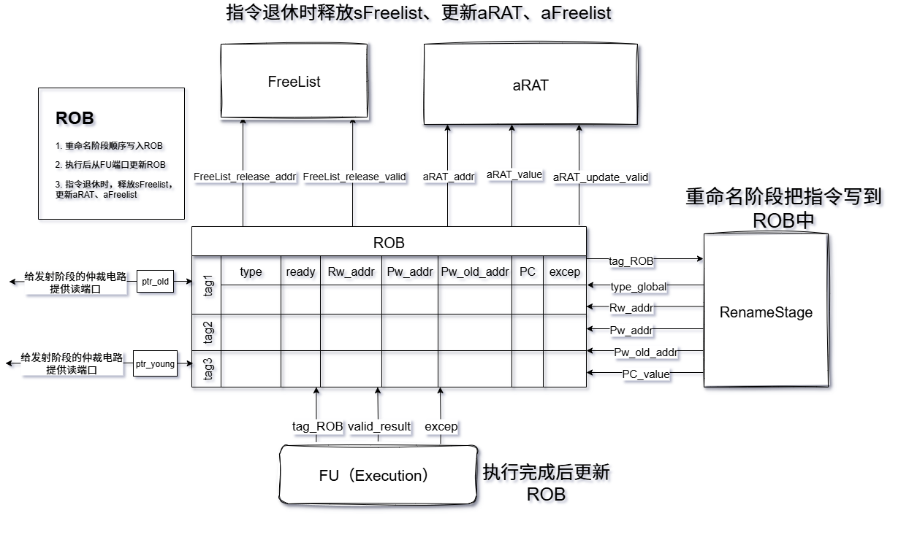

# ALU架构总结

## **整体**

基于arch2=3-2-3多发射原型机，尝试设计：

- 分支预测，
- 基于Architecture State方法的重命名和恢复，
- 分布式、非数据捕捉的乱序发射，
- ADD、MUL双FU执行，
- 提交与退休

## 具体设计

**IF**



IF阶段（参考lza, wyc的设计），使用Gshare技术进行Branch Predict

- 每cc： `PC`输出 `pc`值，并行进行 `INST_MEM `(后续要改为 `INST_CACHE`) 访问，`GSHARE_BRANCH_PREDICTOR`预测

  - `INST_MEM`每cc取 `pc`及邻居，共**3**条指令
  - `GSHARE_BRANCH_PREDICTOR`每cc给出预测 `pc_predict`及其有效性 `predict`
- 预测器维护

  - ID执行后，确认的分支指令信息可对核心数据 `BTB` 做更新
  - EX执行后，`BRU`确认分支逻辑，`branch`信号，对核心状态机 , `PHT`, `FIFO`更新
- PC值更新

  - 按优先级，从状态回滚 `pc_unsel`, 无条件跳转 `pc_jump`, 当前cc所得预测 `pc_predict`, 和默认步长更新 `pc_default`中激情四择

TODO: 

- `PCADD`指令要在IF阶段完成
- `INST_CACHE`需要实现
- `INST_CACHE`对含分支指令的指令块长度需要规划

**ID**



ID阶段平凡地解码，当前产生信号还需要较大改动


**RENAME**



RENAME采用了Architecture State方法，也即同时维护 `sRAT`(speculative reorder alias table), 和aRAT(architecture reorder alias table)，实现了类似于“双指针”般的效果

```plaintext
                aRAT                    sRAT
             aFreelist              sFreelist
               ↓                       ↓
 ┌────┬────┬────┬─────── ... ───────┬────┬────┐
 │    │    │    │                   │    │    │
 └────┴────┴────┴─────── ... ───────┴────┴────┘
               ↑                       ↑
           确认正确的（已commit）    speculative（投机态）
 ─────────────────────────────────────────────→ Static Space
```

TODO

- 控制信号还要再精细化一下

**Issue**



issue阶段采用**分布式、非数据捕捉**的结构，两个发射队列（IssueQueue）分别对应Add和Mul两个FU，每周期从RenameBuffer中分发（Dispatch）总数为machine_width的指令到两个队列中，每条队列中的指令都通过广播总线进行唤醒，随后经由仲裁电路依据OldestFirst的原则，每周期从每个队列中挑选一条指令发射到对应的FU中（事实上，为了将发射阶段的组合逻辑延时和读寄存器分割到两个周期，指令会被发射到每个FU之前的IssueBuffer中寄存起来）
该阶段组合逻辑设计相对复杂，涉及的相关模块较多，是设计难度最大的部分，现对上一版本中的设计经验总结如下： 

* **关于Dispatch**，Dispatch本质上完成了两个功能，一是在每个队列中找到指定数量的空位（注意这个需要的空位数目是动态的，因为每周期的指令组中每种类型的指令数完全不确定），这一功能是每个队列各自完成的；二是把整个指令组的指令分发写入每个队列，这一功能是在整个发射阶段的顶层中完成的（需要统筹所有队列）。换句话说，功能一需要单独实例化，而功能二需要写在顶层模块中。
* **关于WakeUp**，本质上就是通过比对广播信号中的PRF地址信息和每条发射队列中的指令的Pa和Pb来将ready_Pa和ready_Pb置高，整条指令的ready通过组合逻辑取上述两个信号的并。由于与发射队列耦合极好，WakeUp建议直接写在发射队列模块内部而不是单列文件。
* **关于Select**，目前只能实现在同一个队列中的OldestFirst，这也是分布式队列带来的设计困难。在同一个队列中，为了实现OldestFirst，具体方法是读ROB的ptr_old和ptr_young两个指针，加上每条指令的tag_ROB信息可以轻易地判断哪条指令更新，更详细的介绍可以参阅姚版教材Issue章节。
* **关于各类信号传递中伴生的valid信号**的解释：由于大多数信号都是满位的（即信号本身没有多余的位来表示有效性），因此会伴生一个额外的valid信号来标识该信号是有效的还是**空的**。该设计被广泛用于该版代码设计的各类信号传递中，需要加以注意，例如：
  1. FU并不一定每个周期都有指令跑出来，这个时候就给广播总线中的valid信号置低，表示其实这周期是“空的”；
  2. 发射时，每周期并不一定可以向每个FU发射指令，因此将issue_valid信号置低并让其顺着流水线往前走，不会对后端造成任何改变。
* **关于发射阶段的流水线停滞**，分布式队列中的任何一个满了都要停下整个发射阶段及之前的流水线；但允许有的发射队列中无指令可发的情况，不需要也不能停下流水线，如前文所述，置低issue_valid即可
* 其他未尽细节，群里直接问之

**Execution**

这部分没什么好说的，需要配合控制信号的修改进行重新设计，之前是根据如图所示的信号进行处理所有的整数计算指令，经验证是完备的。 
运算类型： 
 
控制信号： 
 

**Commit**



提交阶段的模块设计围绕着ROB进行，ROB所需构建的条目包括type|ready|Rw_addr|Pw_addr|Pw_old_addr|PC|excep，所涉及的交互工作主要包括三个部分：

* 重命名阶段把指令顺序写进ROB中
* 执行完成后根据指令的tag_ROB更新ROB中的ready状态
* 指令退休时释放sFreelist并更新aRAT、aFreelist，这是Architecture-state的设计原则，前文中已经阐述过了。

注意，目前的架构设计采用的是retire时恢复，无论是异常恢复还是分支预测恢复都是如此

## 代码书写中的一些经验

1. 专门用一个文件（PackSignals.sv）预先打包定义好需要的结构体、信号名到值的映射关系、各类参数
2. 适度放弃参数可配置性，追求参数可配置会引入巨大的代码设计复杂度，定义参数最重要的目的还是提升代码的可读性和清晰程度
3. 慎用结构体打包信号，sv不支持单独访问某结构体数组所有元素的某一条目（弗如matlab），写一堆always块做信号转接的时候真的很想吐
4. 注意乘法器最后要调用ip核实现，当前版本因为没有上vivado，暂时写了个a*b上去
