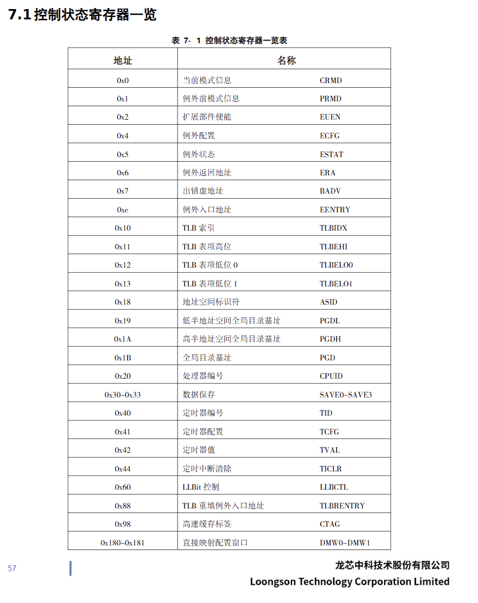

# LA32r中特殊指令的总结

### 1.原子访存指令

> 原子指令的核心思想在于多核并发执行时，对于每次完整的“读-改-写”操作序列的保护，防止出现以下情形
>
> ```csharp
> // 假设两个核心都执行如下非原子的加一操作：
> lw r1, [addr]     ; // 读取 addr 上的值 -> r1
> addi r1, r1, 1    ; // r1 = r1 + 1
> sw r1, [addr]     ; // 写回 r1 到 addr
> ```
>
> 结果可能+1(竞争条件下的非原子问题，数据丢失)或+2(正确)

**因此出现LA32r中的如下定义**

- 每个核拥有独立的LL-SC Unit资产，LL-SC Unit同时具有private和public接口，也即所有核都会参与对每个核内部LL.bit、LL.addr的维护 **(行李箱缝贴发丝)**

  ```plaintext
  ⌌------------------------------------------------⌍
  | LL.bit (1bit) |         LL.addr(32bit)         |
  ⌎------------------------------------------------⌏
  ```
- 以core_1执行一条LL.W-SC.W组为例

  ```
  [core_1]		ll.w		r5		[addr]
  // core_1将addr存入某个entry的LL.addr，并置相应LL.bit为1
  [core_x]		do sth without bothering(store) [addr]
  // 也即LL.bit没被动过
  [core_1]		sc.w	r5		[addr]
  // core_1检查LL.bit（发丝没被扯断x）, 安心地store
  ```
- 动LL.bit的有以下情况

  ```
  执行了ERTN指令且执行时CSR.LLBCTL中的KLO位不等于1
  其它处理器核或CacheCoherentI/Omaster对该LLbit对应的地址所在的Cache行执行完成了一个store操作。
  ```
- 还需要考虑cache与mem一致性的问题，多核架构中mem地址会分为：通过cache读取(cached)/直接从内存读取(uncached)；参与cache coherence/不参与cache coherence
  结论是只要一个地址是 cached 且参与 coherence，且当它被其他核心或设备写入时能触发本核清除 LLbit，那么这个地址就可以安全用于 LL/SC

**原子访存指令的部署**

- 事实上控制信号、数据通路与普通访存区别不大，只是需要做LL_SC Unit访问与维护、提交的特判
- LL.W至少要等到AGU将 `vaddr=GR[rj]+SignExtend({si14,2'b0},32)` 算好，且确认COMMIT，可以与写寄存器同时进行
- SC.W有强顺序需求，需要确认逻辑上在SC.W之前的所有指令正确COMMIT对LL.bit的影响，考虑把SC.W按普通store执行到ROB，然后等待SC成为oldest，此时访问LL.bit因该满足要求
- LL_SC Unit的设计
  需要考虑我们允许ROB中有多少活跃的LL指令，这里需要确保绝对正确，假如Unit满了，是必须要停滞的

```
| LL.tag | LL.bit | LL.addr |
```

### 2.PRELD （pre-load）

> 从内存中预取block并按照hint精确到几级cache地预载cache行

理解上比原子访存简单很多，考虑部署

**预载指令的部署**

- ID阶段需要解析hint，我们只需要处理两种情况: hint=0(load预取至一级数据Cache), hint=8(store预取至一级数据Cache)
- AGU需要计算 `addr=GR[rj]+SignExtend(si12)` 并对齐到cache行/内存块.首地址
- hint=0 load型预取，按照普通load执行到从ROB去到LSU，然后增添信号通路，“强制缺失”
- hint=8 store型预取，按照普通lstore执行到从ROB去到LSU，然后增添信号通路，“强制缺失”，若cache行已脏还要写回
- 如果PRELD指令的访存地址的Cache属性不是cached，那么该指令不能产生访存动作，视同NOP指令处理。PRELD指令不会触发任何与MMU或是地址相关的例外。

### 3.JIRL (jump-imm & reg-link)

> JIRL无条件跳转到目标地址处，同时将该指令的PC值加4的结果写入到通用寄存器rd中。该指令的跳转目标地址是将指令码中的16比特立即数offs16逻辑左移2位后再符号扩展，所得的偏移值加上通用寄存器rj中的值

- 需要进行计算 `GR[rd]=PC+4`    ` PC=GR[rj]+SignExtend({offs16,2'b0},32)` 由于强依赖寄存器值，难以提前到READ stage之前跳转
- 可能不得不在ISSUE READ EX阶段单独开辟jirl的数据通路，熬到那一步已经乱序，jirl可能只能推到EX(分支预测
- 失败恢复可能会很炸裂)/ROB(稳妥)去提交了

### 4.BAR

> 栅障指令分为DBAR(data barrier), IBAR(intruction barrier)
>
> - DBAR指令用于完成**load/store**访存操作之间的栅障功能。其携带的立即数hint用于指示该栅障的同步对象和同步程度。
> - **hint值为0是默认必须实现的**。其指示一个完全功能的同步栅障。只有等到之前所有load/store访存操作彻底执行完毕后，“DBAR0”指令才能开始执行；且只有“DBAR0”执行完成执行后，其后所有load/store访存操作才能开始执行。如果没有专门的功能实现，其它所有hint值都必须按照hint=0执行
> - IBAR指令使用完成单个处理器核内部**store**操作与**取指**操作之间的同步。其携带的立即数hint用于指示该栅障的同步对象和同步程度。
> - **hint值为0是默认必须实现的**。它能够确保“IBAR0”指令之后的取指一定能够观察到“IBAR0”指令之前所有store操作的执行效果。

总结来说

- DBAR0几乎相当于NOP，只是起到LSQ中阻塞的作用
- IBAR0第一次遇到，涉及到“**自修改代码**”的问题，也就是说，代码执行过程中允许对代码字段进行覆写或其他操作，以**减少指令路径长度**提高性能

**DBAR部署**

* 可以当作NOP直通发射到ROB中等待
* **当ROB 发出 DBAR，LSQ 分配一个 entry 给它**
* LSQ  **扫描自己中的访存条目** ，找到逻辑上在 DBAR 前的
* 等它们都 `done == true`，DBAR 才 `done`
* `done` 的信号再返回给 ROB，允许 DBAR 提交，否则DBAR将阻塞LSQ

**IBAR部署**

- 有点麻烦，因为IBAR指令本身是极其保守的
- 早在IF2阶段就预解码，然后完全stall PC取指，是尊重指令设计的，这样做保险而且简单...
- 若“之后的取指”可以阳奉阴违？
- 也先当作NOP直通发射到ROB中等待
- 在ROB中IBAR成为oldest时监测imem store的完成情况，stall COMMIT
- 但需要做失败回滚（如果IBAR退休前真的有inst被修改了，恰好这个地址的原指令还被speculatively取出运行了）

### 5.PCADDU12I

> 即pc add unsigned 12bit imm
>
> 将20比特立即数si20最低位连接上12比特0之后符号扩展，所得数据加上该指令的PC，相加结果写入通用寄存器rd中

比较平凡，留好数据通路即可 `GR[rd]=PC+SignExtend({si20,12'b0},32)`

### **6.SYSCALL**

> 指令格式：syscall code
>
> 执行SYSCALL指令将立即无条件的触发系统调用例外。指令码中code域携带的信息可供例外处理例程作为所传递的参数使用。

即以最高优先权对PC更新到例外程序，可以IF2做，并flush IF1

### 7.BREAK

> 指令格式：break code
>
> 执行BREAK指令将立即无条件的触发断点例外。指令码中code域携带的信息可供例外处理例程作为所传递的参数使用。

### 8.RDCNTV.W,RDCNTID


> - 指令格式：
>
> ```
> rdcntvl.w	rd
> rdcntvh.w	rd
> rdcntid		rj
> ```
>
> - 龙芯架构32位精简版定义了一个恒定频率计时器，其主体是一个64位的计数器，称为 `StableCounter`
>   - `StableCounter` 在复位后置为0，随后每个计数时钟周期自增1，当计数至全1时自动绕回至0继续自增
>   - 同时每个计时器都有一个软件可配置的全局唯一编号，称为CounterID
> - `RDCNTV{L/H}.W` 指令用于读取恒定频率计时器信息，其中
>   - `RDCNTVL.W`	读取Counter的[31:0]位写入通用寄存器rd中
>   - `RDCNTVH.W`	读取Counter的[63:32]位
>   - `RDCNTID` 	Counter ID号信息写入通用寄存器rj中
> - (不重要的信息：)龙芯架构32位精简版与32位龙芯架构对应关系
>   - RDCNTVL.W rd			RDCNTVH.W rd				RDCNTID rj
>   - RDTIMEL.W rd, zero 	RDTIMEH.W rd, zero		RDTIMEL.W zero, rj这三种RDTIME{L/H}.W指令的特殊使用。

**读时钟指令部署**

- ISSUE Stage可以直通
- EX或READ Stage访问 `StableCounter`
- 读取时钟和取指中间有延迟，是否需要处理..

### 9.CSR访问指令<特权指令>

> **CSR： control  and status reg 控制与状态寄存器，常用于 **操作系统和运行时环境** 的设计中**

所以cpu中还需要维护一个

```
reg [31:0] csr_file [0:26];
```



> ##### ✅ **CSRRD**
>
> **缩写** ：**Control and Status Register Read**
>
> **意思** ：从某个CSR读取值，写入到通用寄存器中。
>
> ---
>
> ##### ✅ **CSRWR**
>
> **缩写** ：**Control and Status Register Write**
>
> **意思** ：将通用寄存器的值写入指定的CSR中， **覆盖原值** 。
>
> ---
>
> ##### ✅ **CSRXCHG**
>
> **缩写** ：**Control and Status Register Exchange**
>
> **意思** ：指令根据通用寄存器rj中存放的写掩码信息，将通用寄存器rd中的旧值写入到指定CSR中对应写掩码为1的那些比特，该CSR中的其余比特保持不变，同时将该CSR的旧值更新到通用寄存器rd中，
>
> 是一种**原子性读-改-写**操作，适合并发环境下的控制场景。

**CSR访问部署**

与普通PRF访问类似地

- `CSRRD` :  **READ阶段访问CSR寄存器值** ，（不写CSR，就没破坏系统状态）
- `CSRWR` / `CSRXCHG`:  decode时提取csr_addr、目标值等信息保存在ROB中，**等到COMMIT阶段再真正修改CSR内容** 。

### 10.CACOP <Cache维护指令>

**(by GPT👇)**

> ## ✅ CACOP 指令结构（你必须掌握的核心）
>
> `CACOP code, rj, si12`
>
> 这个三元组决定了：
>
> * 要操作 **哪个地址** ：`VA = GPR[rj] + signedExt(si12)`
> * 要对 **哪种 Cache** ：一级 ICache / 一级 DCache / 二级 Cache？
> * 要进行 **哪种操作** ：初始化？无效化？写回？
>
> ---
>
> ## 🔢 指令编码字段（重点）
>
> 指令的 `code` 字段共  **5 bit** ，你要记住如下划分：
>
> | code[4:3]（高2位） | 意义                     |
> | ------------------ | ------------------------ |
> | `00`             | 初始化 Cache（StoreTag） |
> | `01`             | 直接索引方式一致性维护   |
> | `10`             | 查询索引方式一致性维护   |
> | `11`             | 自定义操作（实现定义）   |
>
> | code[2:0]（低3位） | 作用对象           |
> | ------------------ | ------------------ |
> | `000`            | 一级私有指令 Cache |
> | `001`            | 一级私有数据 Cache |
> | `010`            | 二级共享混合 Cache |
>
> ---
>
> ## 🎯 三类操作的具体行为
>
> | 操作方式                 | 行为简述                                                            | 索引方式          | 写回情况             |
> | ------------------------ | ------------------------------------------------------------------- | ----------------- | -------------------- |
> | StoreTag (`00`)        | 将目标 Cache 行的 tag 置 0，等价于清空                              | 地址直接索引      | 不涉及写回           |
> | IndexInvalidate (`01`) | 按 VA 索引对应行，**使无效（ICache）或使无效+写回（DCache）** | 地址直接索引      | 视情况写回（脏则写） |
> | HitInvalidate (`10`)   | 用 VA 作为 load 地址访问 Cache，**命中才失效/写回**           | 查询方式（带TLB） | 视情况写回           |
> | Custom (`11`)          | 架构保留，厂商可以自定义                                            | -                 | -                    |
>
> ---
>
> ## 🧠 地址解析（关键！）
>
> 如果你要写 Verilog、RTL 控制逻辑，这里你要知道 CACOP 是**怎么选出某一行 Cache**的：
>
> `Cache 为 (1<<Way) 路，每路有 (1<<Index) 行，每行大小 (1<<Offset) 字节`
>
> 那么：
>
> * **选择哪一路** ：`VA[Way-1:0]`
> * **选择哪一行** ：`VA[Index+Offset-1 : Offset]`
> * 注意不需要 offset 位（低位）来选择字节，只要对行操作即可！
>
> ---
>
> ## ❗ 特别注意点（防踩坑）：
>
> * 查询索引方式（code[4:3]=2）可能触发 **TLB 异常**
> * 操作 I-Cache 时 **不写回**
> * 操作 D-Cache 时写回行为由实现决定（你可以只写回脏行）
> * 不关心地址对齐（因为是操作 Cache 行

> ## 整理个执行流程建议（建议你对照自己流水线的 IF / ID / EX / MEM / WB / COMMIT 阶段）：
>
> ### ✅ 1. StoreTag（code[4:3]=00）
>
> * 类似 CSR 写操作，没有实际访存；
> * 放在 **Commit** 阶段，确保只对提交指令做更改；
> * **优势：** 保证精确异常，简化控制。
>
> ### ✅ 2. IndexInvalidate（code[4:3]=01）
>
> * 不需 TLB，不用实际 Cache lookup；
> * 就是个定址计算+直接索引；
> * 也可以在 Commit 阶段做，或做成 **"提前触发但可取消"** 操作。
>
> ### ⚠️ 3. HitInvalidate（code[4:3]=10）
>
> * 和 Load 比较像，需要 VA → PA；
> * 所以要 **早一点解码，访问 TLB** ，甚至可能 stall；
> * 推荐流程：
>   * **ID/EX 阶段解码出需要查询**
>   * **EX 阶段访问 TLB + Cache hit 检查**
>   * 若命中，则发出操作指令（WB前）
>   * 若未命中，进入异常路径
>
> ### ❓ 4. 自定义操作（code[4:3]=11）
>
> * 完全看你实现什么内容；
> * 比如你实现一个 flush，全 Cache清空操作，那就得走状态机；
> * 推荐还是放到 Commit 做触发。

# // TODO

TLB相关...

存储管理...

例外中断...

CSR相关...

!! 一条新增指令: CPUCFG

> 看起来CSR是整数功能完成后可以优先实现的，然后是CSR访问、例外中断将会强依赖于CSR
