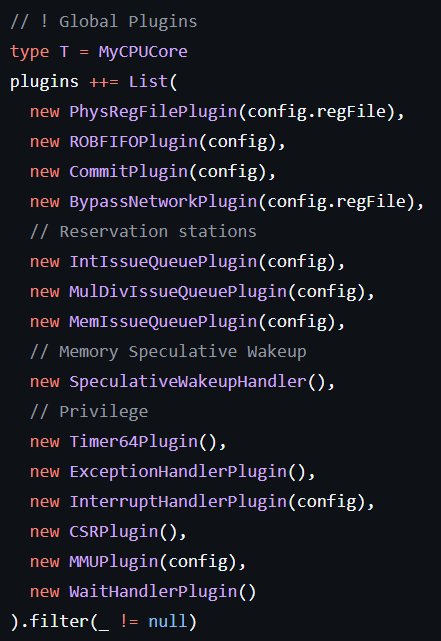
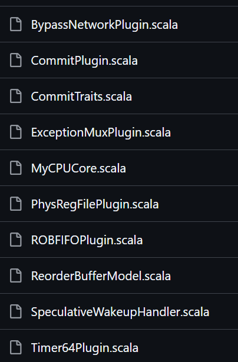

src

* ips: 项目所用ip核
* defines: 宏定义
* pipeline: 流水线结构核心
  * core 大模块划分

    * top: cpucore
    * 在cpucore同级路径并列了一系列global plugins:
    * PRF, ROBFIFO, Bypass, Int、Mul、Div、Mem的IssueQueuem......

    如图      
  * 在core 同级路径并列了一系列功能模块文件夹：
  * decode, exe, fetch, mem, privilege

    * core/
      BypassNetworkPlugin.scala：实现流水线旁路网络，用于数据前递。
      CommitPlugin.scala：主提交单元插件，管理指令提交和相关操作。
      CommitTraits.scala：定义提交相关 trait 和接口。
      ExceptionMuxPlugin.scala：异常多路复用插件，处理不同来源的异常。
      MyCPUCore.scala：核心流水线顶层集成模块。
      PhysRegFilePlugin.scala：物理寄存器文件管理插件。
      ROBFIFOPlugin.scala：重排序缓冲区 FIFO 相关逻辑。
      ReorderBufferModel.scala：重排序缓冲区模型。
      SpeculativeWakeupHandler.scala：投机唤醒处理逻辑。
      Timer64Plugin.scala：64位定时器插件。
      查看更多 core 文件

      fetch/
      BranchPredictModel.scala：分支预测模型实现。
      FetchBufferPlugin.scala：取指缓冲区插件。
      FetchDebug.scala：取指阶段调试辅助。
      FetchPipeline.scala：取指阶段主流水线实现。
      FetchSignals.scala：取指阶段信号定义。
      GlobalPredictorBTBPlugin.scala：全局分支预测及 BTB 相关插件。
      ICachePlugin.scala：指令缓存（ICache）管理。
      InstAddrTranslationPlugin.scala：指令地址转换插件。
      ProgramCounterPlugin.scala：PC 寄存器管理插件。
      ReturnAddressStackPlugin.scala：返回地址栈插件，用于支持函数调用返回预测。
      查看更多 fetch 文件

      decode/
      DecodeMicroOP.scala：译码微操作定义。
      DecodePipeline.scala：译码阶段主流水线实现。
      DecodeSignals.scala：译码阶段信号定义。
      DecoderArrayPlugin.scala：指令译码阵列插件，支持多发射。
      InstructionParser.scala：指令解析模块。
      RenameModel.scala：寄存器重命名模型。
      RenamePlugin.scala：寄存器重命名插件。
      查看更多 decode 文件

      exe/
      ALU.scala：算术逻辑单元（ALU）实现。
      BRU.scala：分支判断单元（BRU）实现。
      Comparator.scala：比较器模块。
      ExecutePipeline.scala：执行阶段主流水线实现。
      IntExecutePlugin.scala：整数执行插件。
      IntIssueQueuePlugin.scala：整数发射队列插件。
      IssueSlot.scala：指令发射槽实现。
      MulDivExecutePlugin.scala：乘除执行插件。
      MulDivIssueQueuePlugin.scala：乘除发射队列插件。
      查看更多 exe 文件

      mem/
      AddressGenerationPlugin.scala：访存地址生成插件。
      DCachePlugin.scala：数据缓存（DCache）管理插件。
      DirtyBitsManager.scala：脏位管理模块。
      LoadPostProcessPlugin.scala：Load 指令后处理插件。
      MemExecutePlugin.scala：访存阶段执行插件。
      MemIssueQueuePlugin.scala：访存发射队列插件。
      MemPipeline.scala：访存阶段主流水线实现。
      StoreBufferPlugin.scala：Store Buffer（写缓冲区）插件。
      UncachedAccess.scala：非缓存访问处理模块。
      查看更多 mem 文件

      privilege/
      CSRPlugin.scala：CSR（控制与状态寄存器）管理插件。
      ExceptionHandlerPlugin.scala：异常处理插件。
      InterruptHandlerPlugin.scala：中断处理插件。
      MMUPlugin.scala：内存管理单元（MMU）插件。
      WaitHandlerPlugin.scala：等待/睡眠状态处理插件。
      查看更多 privilege 文件
* plugins: 全局插件